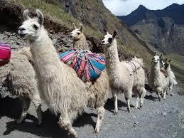

<!DOCTYPE html>
<html>
    <head>
        <meta charset="UTF-8">
        <title>Finding Llama</title>
        <link rel="stylesheet" href="style/main.css">
        <link rel="stylesheet" href="https://maxcdn.bootstrapcdn.com/bootstrap/3.4.1/css/bootstrap.min.css">
        
        
    </head>

    <body ng-app="mainApp" ng-controller="mainController">
        <header>
            
 

            
 Finding Llama

        </header>
        <section class="main-section">
            

                
About Llama

                
About Me

            

            

                

                    

                        
Basic info

                        
Scientific Details

                        
Social Life

                        
Facts

                    

                    

                        

                            

                                
Llama - a camel like social animal found in South America have widely domesticated since 
                                    pre Columbus era mainly used for transportation. They are around 1.7m to 1.8m tall at 
                                    the top of the head and weight around 300-400 lbs. Unlike camels they do not have hump
                                    although they are highly thirst tolerant enabling them to walk 5-8 miles while carrying
                                    loads euivalent upto 30% of their body weight. Also, can reach speeds up to 35mph.
                                

                            

                            

                                
                            

                        

                        

                            

                                
Scientific name (species) of llama is 'Lama glama'. Their average life span is 15-20 
                                    years. Due to their extremly long and complex intestine they can survive on much 
                                    less water water, vitamins and electrolytes gets reabsorbed while food waste is passing
                                     through. Their three compartment stomach allows them to comsume low quality high 
                                     cellulose food such as grass
                                

                                

                                    As they are mammals, they breed through mating. While females are mature to breed at 18
                                    -24 months old, males get mature to breed at an age of around 3 years. The gestation 
                                    period is approximately 350 days. Typically, only one cria (llama baby) is born at a time. 
                                
    
                            

                            

                                
                            

                        

                        

                            

                                
Llamas are very well-socialized among themselve and often with human as well due to 
                                    which they can be well trained. They usually stay in families and trigger high 
                                    pitch alarms to warn other members in case of danger. However, they may spit 
                                    for the quest of rank. In case of mistreat, they may spit human as well although
                                    it is quite rare.
                                

                                

                                    Due to the ease of training and litte care, they are very useful. They are often used as 
                                    pack animals. In North America, they have been used as guard animals. Also, they are 
                                    good source of fibre due to their fine undercoat, which can be used for handicrafts and 
                                    garments of different colors. Due to lack of odor, their excreta is used as eco-friendly
                                    fertilizers.
                                

                            

                            

                                
                            

                        

                        

                            

                                
So llamas are smart, friendly, cooperative, fast, alert, and durable. With all these 
                                    qualifications llama became the national symbol of Peru. But that's it? Are they meant 
                                    to be just guards or do they have larger scope? Yes, they can be your fighter, savior in case of
                                    war. 
                                

                                

                                    "You players, you Villagers. Your war is destroying our world!" - Steve the Llama
                                

                                
Steve the llama aka The Mighty Llama Spirit is a fictional charactor is know for such
                                    traits.
                                

                            

                            

                                
                            

                        

                    

                

                

                    

                        
My info

                        
Web Details

                        
Tech Details

                    

                    

                        

                            

                                
Currently, I am a master's student at NYU Courant. I have full time experience of 
                                    developing web-applications that are scalable, responsive, localized, support
                                    accessibility (WCAG 2.0) and are used by thousands of people world wide every day.
                                    I find this field (especially the front-end) as quite challenging as it has to deal
                                    with several changes such as browser updates, device changes, cross-platform and 
                                    network speed. Therefore, an error-free site has to be tolerant to these.
                                

                                
<a href="https://www.linkedin.com/in/dibyajit/" target="_blank">Click here for my 
                                    complete profile </a>

                            

                            

                                
                            

                        

                        

                            

                                
This site is structured into two main components - one for information related to llama
                                    that is the main purpose of the site, another for the details of the author and the technical
                                    details of this site.
                                

                                

                                    Since it is a very light weight site, it is a single page application. While maintaining 
                                    a basic layout without using too many fancy CSS stuffs, different skills have been 
                                    demonstrated. Visitor can get the information without scroll and it is responsive to
                                    different screen sizes.
                                

                                

                                    Different types of information about llama have been segregated so that it can helpful
                                    for different section of visitors. Whether someone just wants to know about what is 
                                    llama or someone is searching for some fun facts, this site serves everyone. 
                                

                            

                            

                                
                            

                        

                        

                            

                                
Apart from basic HTML, CSS and JavaScript, AngularJs has been used for switching 
                                    contents based upon menu items click. Since AngularJs provides two way binding, it
                                    eases the effort of controlling DOM elements through JavaScript. 
                                

                                

                                    In order to make it responsive, Bootstrap has been used. Since there isn't too much css
                                    involved therefore no CSS pre-processor has been used.   
                                

                            

                            

                                
                            

                        

                        

                

            

        </section>
        <footer></footer>
    </body>

</html>
